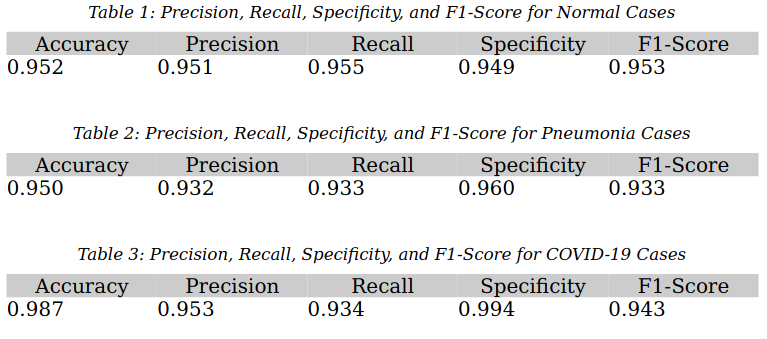

# SARS-CoV-2 X-Ray Classification Project

This is a deep-learning approach to the image classification of SARS-CoV-2 pneumonia, non-COVID-19 Pneumonia, or normal findings from patient chest x-rays. This project was completed as part of a one semester thesis course at Laurentian University.

## Table of Contents

* [General Information](#general-information)
* [Results](#results)
* [Technologies](#technologies)
* [Usage](#usage)
* [Datasets](#datasets)

## General Information

This project was an introduction to machine learning and Computer Vision (CV), as well as the topic of my thesis work. During the timeframe of this project I had to tackle issues including: accounting for class imbalance, proper metric selection, data preprocessing, hyperparameter selection, platform-specific challenges with Arch Linux, among others. Project was developed for a GNU/Linux environment and while precautions were taken for platform-agnosticism, compatibility is not guaranteed.

## Results

  
  

## Technologies

* Python 3.9
* Jupyter Notebook
* Pandas
* Tensorflow / Keras
* NumPy
* Bash

## Usage

1. Download all databases to their respective directories in ./dataset
2. Dataset Construction.ipynb
3. Format Dicom Datasets.ipynb
4. SMOTE Resampling.ipynb
5. train.py to train the model
```
usage: train.py [-h] [--epochs [Integer]] [--lr [Float]]

options:
  -h, --help          show this help message and exit
  --epochs [Integer]  Number of Epochs to train for
  --lr [Float]        Starting learning rate for this session
```

6. Prediction.ipynb to generate predictions and performance graphics, or alternatively predict.py to just generate predictions

## Datasets

Below is a list of datasets used to train my model:

* https://github.com/ieee8023/covid-chestxray-dataset
* https://github.com/agchung/Figure1-COVID-chestxray-dataset
* https://github.com/agchung/Actualmed-COVID-chestxray-dataset
* https://wiki.cancerimagingarchive.net/pages/viewpage.action?pageId=70230281
* https://www.kaggle.com/c/rsna-pneumonia-detection-challenge
